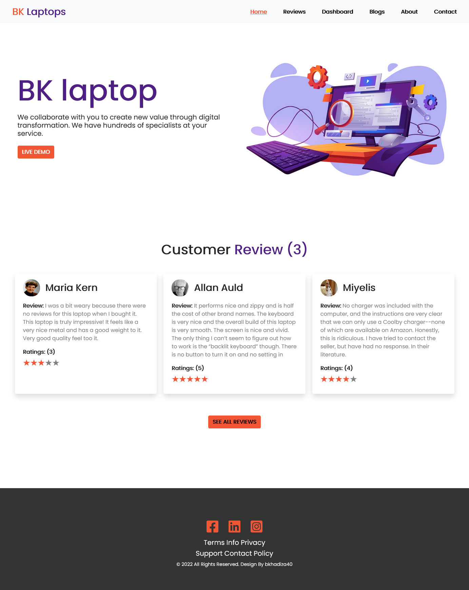

# BK-Laptop-Analysis - React-Router

## Live Site Link: https://bk-laptop-analysis-react-router.netlify.app/

### code link: https://github.com/programming-hero-web-course-4/product-analysis-website-khadiza21

#### About my project--

- This is a website "Laptop Analysis".The website is for laptop analysis Purpose.

- This project is made by Mainly routing , react and another use here html and React and JS. Routing is like path that can help to visit us one part to another part without reloading page and react is a framework of JS.It's makes programmer life easy.

- In this website buyer can take laptop and get services  about laptop and they can repair their laptop . 

- Here User can see other persons reviews and also can read some blogs. Viewer get contact info and can know to about us.

